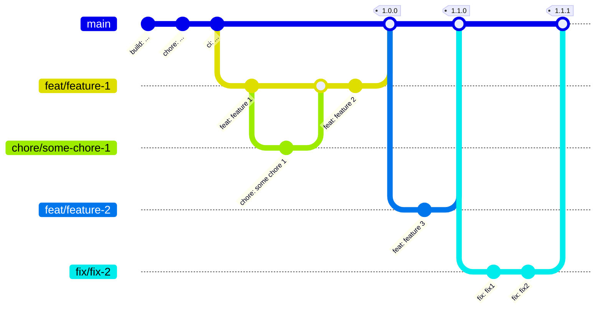

+++

title = "Revue"
description = "A real-time video surveillance and environment monitoring system"
outputs = ["Reveal"]
aliases = [
    "/guide/"
]

+++

# Revue

## A real-time video surveillance and environment monitoring system

---

<!-- write-here "shared-slides/introduction.md" -->
<!-- end-write -->

---

## Requirements

Detailed requirements can be found in the [documentation](https://revue-org.github.io/revue/docs/report/analysis/business-requirements).

---

# Design

---

<!-- write-here "shared-slides/design/event_storming.md" -->
<!-- end-write -->

---

<!-- write-here "shared-slides/design/bounded_context.md" -->
<!-- end-write -->

---

<!-- write-here "shared-slides/design/context_map.md" -->
<!-- end-write -->

---

<!-- write-here "shared-slides/architecture/architecture.md" -->
<!-- end-write -->

---

<!-- write-here "shared-slides/architecture/microservices.md" -->
<!-- end-write -->

---

<!-- write-here "shared-slides/architecture/clean_architecture.md" -->
<!-- end-write -->

---

# Dev Ops

---

## Version Control (1/2)

- A single stable `main` branch with the working code. 
- Changes are made in dedicated branches (_feature/name_, _fix/name_, _chore/what_, etc.) 

- Changes are merged into the main branch via pull requests. 
- Pull requests are reviewed and approved by at least one other developer
- Releases are made on the `main` branch.

---

## Version Control (2/2)

- Commit messages are standardized, according to _[Conventional Commits](https://www.conventionalcommits.org/en/v1.0.0/)_.

- Source code version number follows the rules of _[Semantic Versioning](https://semver.org/)_.

---

## Build Automation

### Plugin

As an empowerment of the Node package manager, this [plugin](https://github.com/kelvindev15/npm-gradle-plugin) has been used for dependencies, devDependencies, and scripts.

### Dependency management

[Renovate](https://docs.renovatebot.com/) has been used to keep all dependencies automatically up to date

---

## Quality Assurance

- [Prettier](https://prettier.io/): a code formatter with support for many languages.
- [ESLint](https://eslint.org/): static code analysis tool for identifying problematic patterns.
- [Codefactor](https://www.codefactor.io/): review code style and security on every pull request.
- [SonarCloud](https://www.sonarsource.com/products/sonarcloud/): code quality and security service
- [Codacy](https://www.codacy.com/): automated code review tool

--- 

## Workflow

---

## License

The project is licensed under the [MIT License](https://mit-license.org/) because of its permissive nature.

---

<!-- write-here "shared-slides/deployment/deployment.md" -->
<!-- end-write -->

---

<!-- write-here "shared-slides/deployment/kubernetes.md" -->
<!-- end-write -->

---

<!-- write-here "shared-slides/deployment/cluster_overview.md" -->
<!-- end-write -->

