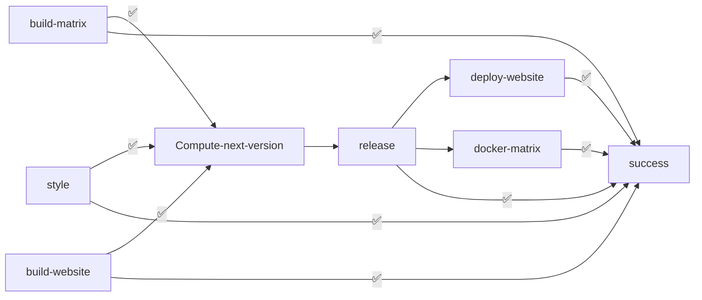

+++

title = "Revue"
description = "A real-time video surveillance and environment monitoring system"
outputs = ["Reveal"]
aliases = [
    "/guide/"
]

+++

# Revue

## A real-time video surveillance and environment monitoring system

---

<!-- write-here "shared-slides/introduction.md" -->
<!-- end-write -->

---

# Analysis

---

## Requirements

Detailed requirements can be found in the [documentation](https://revue-org.github.io/revue/docs/report/analysis/business-requirements).

---

# Design

---

<!-- write-here "shared-slides/design/event_storming.md" -->
<!-- end-write -->

---

<!-- write-here "shared-slides/design/bounded_context.md" -->
<!-- end-write -->

---

<!-- write-here "shared-slides/design/context_map.md" -->
<!-- end-write -->

---

<!-- write-here "shared-slides/architecture/architecture.md" -->
<!-- end-write -->

---

<!-- write-here "shared-slides/architecture/microservices.md" -->
<!-- end-write -->

---

<!-- write-here "shared-slides/architecture/clean_architecture.md" -->
<!-- end-write -->

---

# Dev Ops

---

## Version Control

---

## Build Automation

---

## Quality Assurance

--- 

## Workflow

---

## License

---

<!-- write-here "shared-slides/deployment/deployment.md" -->
<!-- end-write -->

---

<!-- write-here "shared-slides/deployment/kubernetes.md" -->
<!-- end-write -->

---

<!-- write-here "shared-slides/deployment/cluster_overview.md" -->
<!-- end-write -->

